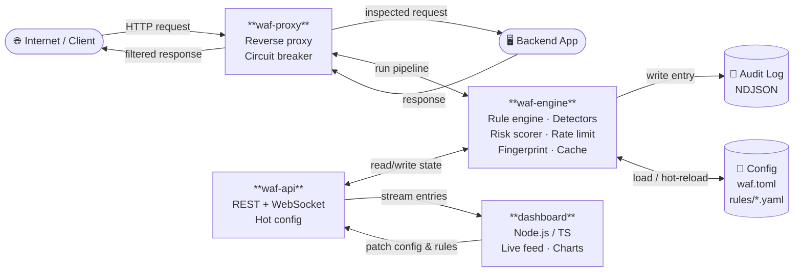
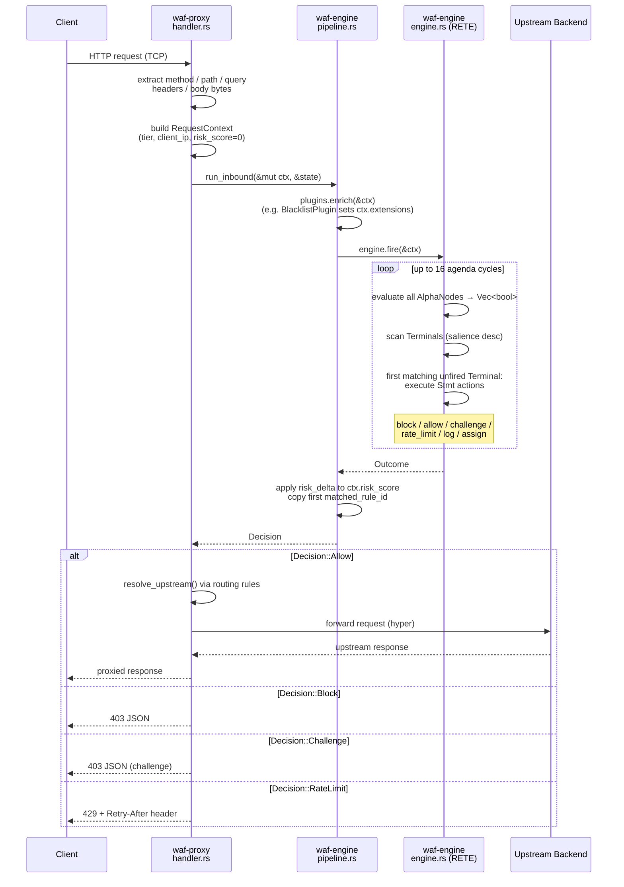
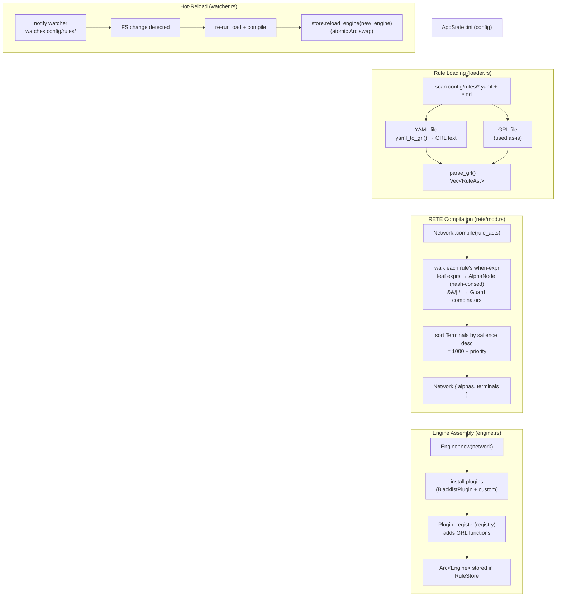
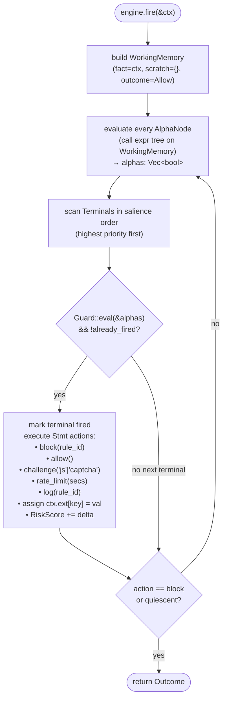
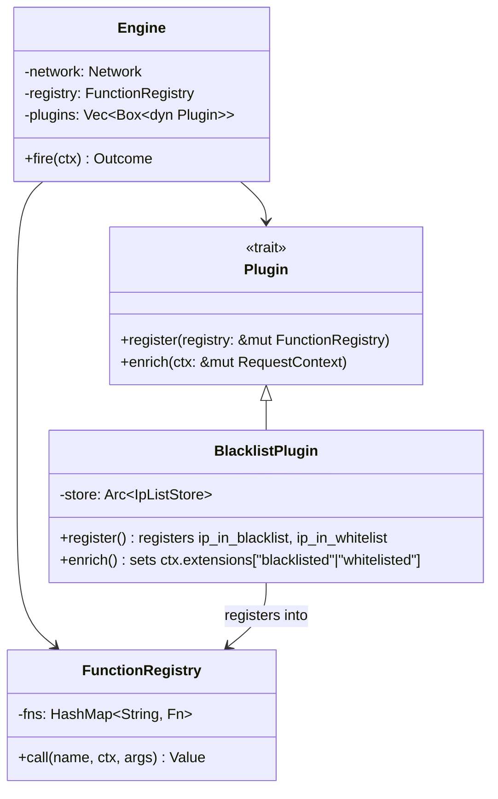

# Architecture



## Nodes

| Node | Crate / Component | Role |
|------|-------------------|------|
| Internet / Client | — | Inbound HTTP traffic |
| **waf-proxy** | `crates/waf-proxy` | Accepts connections, forwards to backend, applies decisions; circuit breaker for upstream |
| **waf-engine** | `crates/waf-engine` | Rule matching, all detectors (SQLi, XSS, …), risk scoring, rate limiting, device fingerprinting, response filtering, cache |
| Backend App | — | Protected upstream; zero awareness of the WAF |
| **waf-api** | `crates/waf-api` | axum REST + WebSocket; exposes live feed and hot-config endpoints |
| **Dashboard** | `dashboard/` | Node.js / TypeScript UI — live request feed, attack charts, hot config panel |
| Config | `config/waf.toml` + `config/rules/*.yaml` | All runtime configuration; hot-reloaded by the engine via filesystem watcher |
| Audit Log | `logs/audit.jsonl` | Append-only NDJSON written by the engine after every request; SIEM-ingestible |

---

## Crate Dependency Graph

```
waf  (binary)
 ├── waf-proxy   ──► waf-engine ──► waf-types
 ├── waf-engine  ──► waf-types
 └── waf-api     ──► waf-engine
```

`waf-types` owns the shared primitives (`Decision`, `RiskScore`, `AuditEntry`, `Tier`).  
`waf-engine` owns all logic: rule loading, RETE compilation, pipeline execution, stores, plugins.  
`waf-proxy` and `waf-api` are thin servers that call into `waf-engine`.  
`waf` is the entry-point binary: loads config, initialises `AppState`, `tokio::try_join!`s both servers.

---

## Inbound Request Pipeline



---

## Rule Loading & RETE Compilation



---

## RETE Engine Evaluation Detail

The engine (`waf-engine/src/rules/rete/engine.rs`) runs a **forward-chaining RETE loop** over the compiled network:



**AlphaNode evaluation** calls `WorkingMemory::resolve_path()` which maps GRL path segments to `RequestContext` fields:

| GRL path | `RequestContext` field |
|---|---|
| `Request.Method` | `ctx.method` |
| `Request.Path` | `ctx.path` (URL-decoded) |
| `Request.Body` | `ctx.body` (UTF-8 lossy) |
| `Request.ClientIp` | `ctx.client_ip` |
| `Request.Headers["name"]` | `ctx.headers` lookup |
| `Request.Ext["key"]` | `ctx.extensions` lookup |
| `Request.RiskScore` | `ctx.risk_score.0` |

**Built-in GRL functions** (`functions.rs`):

| Function | Purpose |
|---|---|
| `matches(s, pattern)` | regex match |
| `contains(s, sub)` | substring check |
| `starts_with` / `ends_with` | string predicates |
| `lower` / `upper` / `len` | string utils |
| `contains_sqli(s)` | SQLi regex detector |
| `contains_xss(s)` | XSS regex detector |
| `contains_path_traversal(s)` | path traversal detector |
| `contains_cmd_injection(s)` | command injection detector |
| `contains_header_injection(s)` | CRLF injection detector |

Plugin-registered functions (`BlacklistPlugin`):

| Function | Source |
|---|---|
| `ip_in_blacklist(ip)` | `IpListStore` (CIDR-aware) |
| `ip_in_whitelist(ip)` | `IpListStore` (CIDR-aware) |

---

## Rule YAML → GRL → RETE (Example)

Given `config/rules/critical.yaml`:
```yaml
- id: SQLI-001
  priority: 1
  scope: Global
  condition:
    SqliPattern:
      field: body
  action: Block
  risk_score_delta: 50
```

**Step 1 — `yaml_to_grl()` converts to GRL text:**
```
rule "SQLI-001" salience 999 {
    when
        contains_sqli(Request.Body)
    then
        Request.RiskScore = Request.RiskScore + 50;
        block("SQLI-001");
}
```

**Step 2 — `parse_grl()` produces a `RuleAst`** with:
- `when: Expr::Call { name: "contains_sqli", args: [Expr::Path("Request.Body")] }`
- `then: [Stmt::Assign(RiskScore, ...), Stmt::Call("block", ["SQLI-001"])]`

**Step 3 — `Network::compile()` produces:**
- One `AlphaNode` for `contains_sqli(Request.Body)` (hash-consed by canonical expr string)
- One `Terminal { salience: 999, guard: Guard::Alpha(id0), actions: [...] }`

**Step 4 — at request time**, `AlphaNode` calls `contains_sqli(ctx.body)` → `true` → `Guard::Alpha(id0)` → terminal fires → `block("SQLI-001")` → `Decision::Block`.

---

## Plugin System



New detectors can be added without touching the RETE core: implement `Plugin`, call `engine.install(plugin)` in `AppState::init`.
